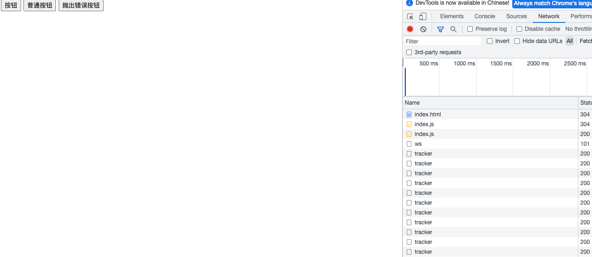

# express
模拟后端接口
# tracker
[npm](https://www.npmjs.com/package/thinksdk-tracker)

# 演示文件
运行express，然后打开tracker文件下的index.html open with liveserver
https://github.com/ThinkerWing/demo/blob/master/sdk/tracker/index.html
